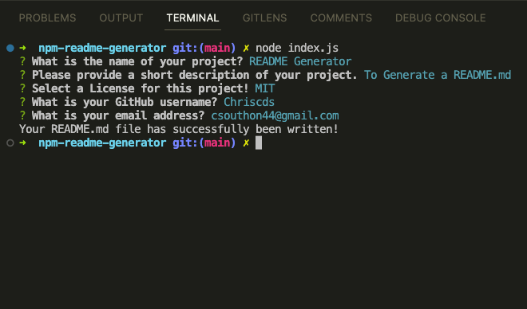
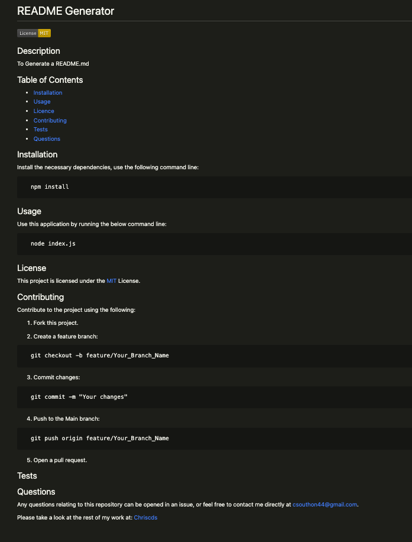

# NPM Readme Generator

## Description
A node.js application, to generate a readme file for your project from the command line using npm. Create a README.md file from user input, including license badges and contact information, to save time on writing out the users initial README.md. 

You can view a video of the working application [here](https://drive.google.com/file/d/18ikr3YlVLBqlTM3PZweZqLNMdW8YeSkX/view)

## Table of Contents
- [Installation](#Installation)
- [Usage](#Usage)
- [Screenshots](#Screenshots)
- [License](#License)
- [Contributing](#Contributing)
- [Tests](#Tests)
- [Questions](#Questions)

## Installation

Install the necessary dependencies, use the following command line:

<pre>
  <code>npm install</code>
</pre>

## Usage

Use this application by running the below command line:

<pre>
  <code>node index.js</code>
</pre>

## Screenshots

## License

This project is licensed under MIT.

## Contributing

Contribute to the project using the following:

1. Fork this project.
2. Create a feature branch:

<pre>
  <code>git checkout -b feature/Your_Branch_Name</code>
</pre>

3. Commit changes:

<pre>
  <code>git commit -m "Your changes"</code>
</pre>

4. Push to the Main branch:

<pre>
  <code>git push origin feature/Your_Branch_Name</code>
</pre>

5. Open a pull request.

## Tests

## Questions

Any questions relating to this repository can be opened in an issue, or feel free to contact me 
directly at csouthon44@gmail.com.

Please take a look at the rest of my work at: [Chriscds](https://github.com/Chriscds)

